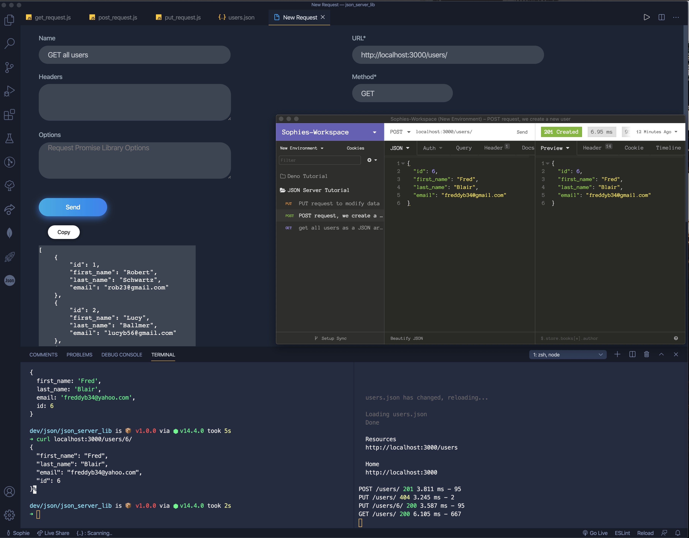
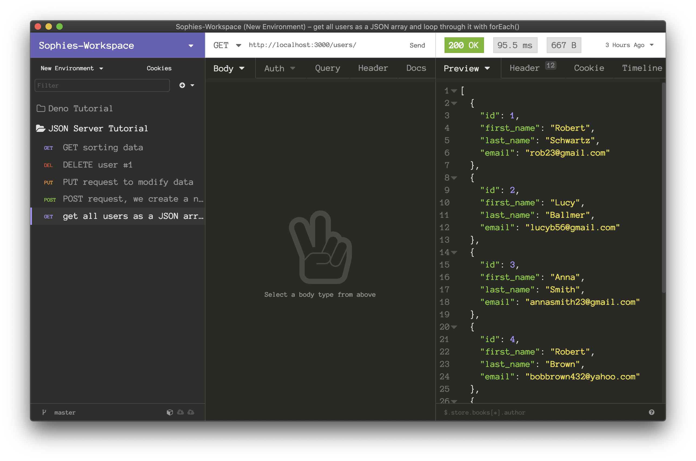

# JSON Server Tutorial

**JSON Server** tutorial introduces the JavaScript `json-server` library, which can be used to create **fake REST API**.

## JSON server

The *json-server* is a JavaScript library to create testing REST API.

## Tools

* **VSC**
* **Simple REST Client** *VSC extension* (Easy to examine your API's responses directly within VSC. Send requests to verify your API)



Or alternatively

* **Insomnia**


## JSON Server installation


First, we create a project directory an install the `json-server` module.

`$ mkdir json-server-lib`

`$ cd json-server-lib`

`$ npm init -y`

`$ npm i -g json-server`

The JSON server module is installed globally with `npm`.

`$ npm install axios`

In addition, we install the `axios` module, which is a promise-based **JavaScript HTTP client**.

`$ cat package.json`

```json
{
  "name": "json-server-lib",
  "version": "1.0.0",
  "description": "",
  "main": "index.js",
  "dependencies": {
    "axios": "^0.18.0"
  },
  "devDependencies": {},
  "scripts": {
    "test": "echo \"Error: no test specified\" && exit 1"
  },
  "keywords": [],
  "author": "",
  "license": "ISC"
}
```

This is our `package.json` file.

## JSON test data

We have some **JSON test data**:

`users.json`

```json
{
  "users": [
    {
      "id": 1,
      "first_name": "Robert",
      "last_name": "Schwartz",
      "email": "rob23@gmail.com"
    },
    {
      "id": 2,
      "first_name": "Lucy",
      "last_name": "Ballmer",
      "email": "lucyb56@gmail.com"
    },
    {
      "id": 3,
      "first_name": "Anna",
      "last_name": "Smith",
      "email": "annasmith23@gmail.com"
    },
    {
      "id": 4,
      "first_name": "Robert",
      "last_name": "Brown",
      "email": "bobbrown432@yahoo.com"
    },
    {
      "id": 5,
      "first_name": "Roger",
      "last_name": "Bacon",
      "email": "rogerbacon12@yahoo.com"
    }
  ]
} 
```
   
## Starting JSON server

The JSON server is started with the `json-server`, which we have installed globally.

`$ json-server --watch users.json `   

The `--watch` command is used to specify the data for the server.

`$ curl localhost:3000/users/3/`

```json
{
  "id": 3,
  "first_name": "Anna",
  "last_name": "Smith",
  "email": "annasmith23@gmail.com"
}
```

With the `curl` command, we get the user with **Id 3**.

## JSON Server GET request

In the next example we retrieve data with a **GET request**.

`get_request.js`

```js
const axios = require('axios');

axios.get('http://localhost:3000/users')
    .then(resp => {
        data = resp.data;
        data.forEach(e => {
            console.log(`${e.first_name}, ${e.last_name}, ${e.email}`);
        });
    })
    .catch(error => {
        console.log(error);
    });   
```
 
With the axios module, we get all users as a JSON array and loop through it with `forEach()`.

`$ node get_request.js `

```markdown
Robert, Schwartz, rob23@gmail.com
Lucy, Ballmer, lucyb56@gmail.com
Anna, Smith, annasmith23@gmail.com
Robert, Brown, bobbrown432@yahoo.com
Roger, Bacon, rogerbacon12@yahoo.com
```

This is the output of the example. We get **all users** and print their **full names** and **emails**.

## JSON Server POST request

With a **POST request**, we create a new user.

`post_request.js`

```js
const axios = require('axios');

axios.post('http://localhost:3000/users', {
    id: 6,
    first_name: 'Fred',
    last_name: 'Blair',
    email: 'freddyb34@gmail.com'
}).then(resp => {
    console.log(resp.data);
}).catch(error => {
    console.log(error);
});   
```

A new user is created with **axios**.

`$ node post_request.js `

```json
{ id: 6,
  first_name: 'Fred',
  last_name: 'Blair',
  email: 'freddyb34@gmail.com' }
```
  
The server responds with a **newly created object**.

`$ curl localhost:3000/users/6/`

```json
{
  "id": 6,
  "first_name": "Fred",
  "last_name": "Blair",
  "email": "freddyb34@gmail.com"
}
```

We verify the **newly created user** with the `curl` command.

## JSON Server modify data with PUT request

In the following example we modify data with a **PUT request**.

`put_request.js`

```js
const axios = require('axios');

axios.put('http://localhost:3000/users/6/', {
    first_name: 'Fred',
    last_name: 'Blair',
    email: 'freddyb34@yahoo.com'
}).then(resp => {

    console.log(resp.data);
}).catch(error => {

    console.log(error);
});
```

In the example, we **modify** the **user's email address**.

`$ node put_request.js `

```json
{ first_name: 'Fred',
  last_name: 'Blair',
  email: 'freddyb34@yahoo.com',
  id: 6 }
```

This is the output.

## JSON Server DELETE request

In the following example, we show how to delete a user with a **DELETE request**.

`delete_request.js`

```js
const axios = require('axios');

axios.delete('http://localhost:3000/users/1/')
    .then(resp => {
        console.log(resp.data)
    }).catch(error => {
        console.log(error);
    });
```

In the example, we **delete** the user with **Id 1**.

`$ node delete_request.js `

```json
{}
```

The server responds with empty JSON data.

## JSON Server sorting data

In the next example, we **sort** our **data**.

`sort_data.js`

```js
const axios = require('axios');

axios.get('http://localhost:3000/users?_sort=last_name&_order=asc')
    .then(resp => {
        data = resp.data;
        data.forEach(e => {
            console.log(`${e.first_name}, ${e.last_name}, ${e.email}`)
        });
    }).catch(error => {
        console.log(error);
    });    
```

The code example **sorts** data by the **users' last name in ascending order**. We use the `_sort` and `_order` **query parameters**.

`$ node sort_data.js `

```markdown
Roger, Bacon, rogerbacon12@yahoo.com
Lucy, Ballmer, lucyb56@gmail.com
Fred, Blair, freddyb34@yahoo.com
Robert, Brown, bobbrown432@yahoo.com
Robert, Schwartz, rob23@gmail.com
Anna, Smith, annasmith23@gmail.com
```

This is the output.

## JSON Server operators

We can use `_gte `and `_lte` for getting a **specific range of data**.

`operators.js`

```js
const axios = require('axios');

axios.get('http://localhost:3000/users?id_gte=4')
    .then(resp => {
        console.log(resp.data)
    }).catch(error => {
        console.log(error);
    }); 
```

The code example show users with **id greater than or equal to 4**.

`$ node operators.js `

```json
[ { id: 4,
    first_name: 'Robert',
    last_name: 'Brown',
    email: 'bobbrown432@yahoo.com' },
  { id: '5',
    first_name: 'Roger',
    last_name: 'Bacon',
    email: 'rogerbacon12@yahoo.com' },
  { first_name: 'Fred',
    last_name: 'Blair',
    email: 'freddyb34@yahoo.com',
    id: 6 } ]
```

This is the output.

## JSON Server full text search

A **full text search** can be performed with the `q` **parameter**.

`full_text_search.js`

```js
const axios = require('axios');

axios.get('http://localhost:3000/users?q=yahoo')
    .then(resp => {
        console.log(resp.data)
    }).catch(error => {
        console.log(error);
    });
```

The code example searches for the **yahoo term**.


`$ node full_text_search.js `

```json
[ { id: 4,
    first_name: 'Robert',
    last_name: 'Brown',
    email: 'bobbrown432@yahoo.com' },
  { id: '5',
    first_name: 'Roger',
    last_name: 'Bacon',
    email: 'rogerbacon12@yahoo.com' },
  { first_name: 'Fred',
    last_name: 'Blair',
    email: 'freddyb34@yahoo.com',
    id: 6 } ]
```

The **search query** returned these **three users**.


In this tutorial, we have introduced the **JSON Server JavaScript library**.